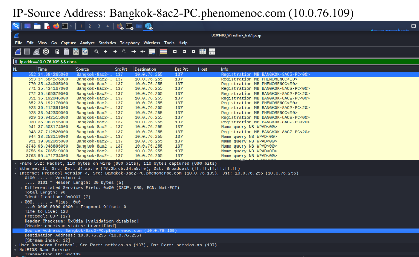
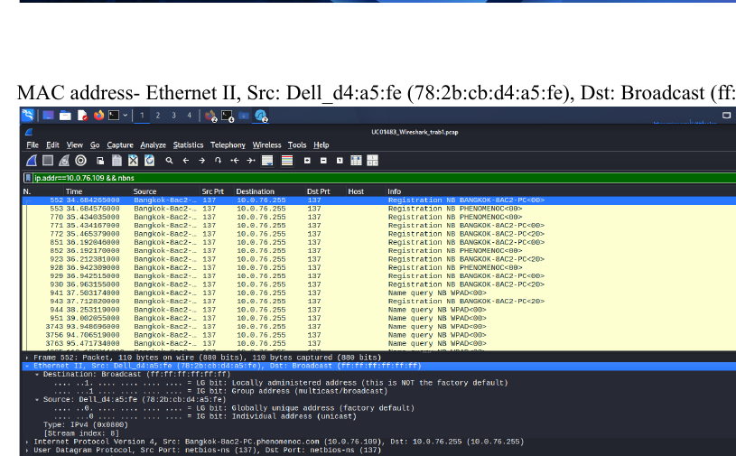
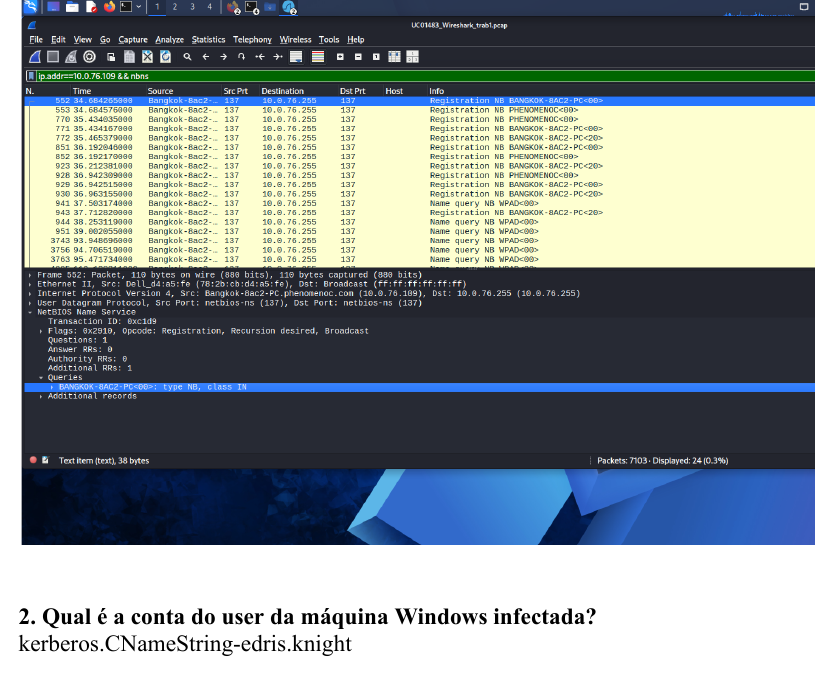
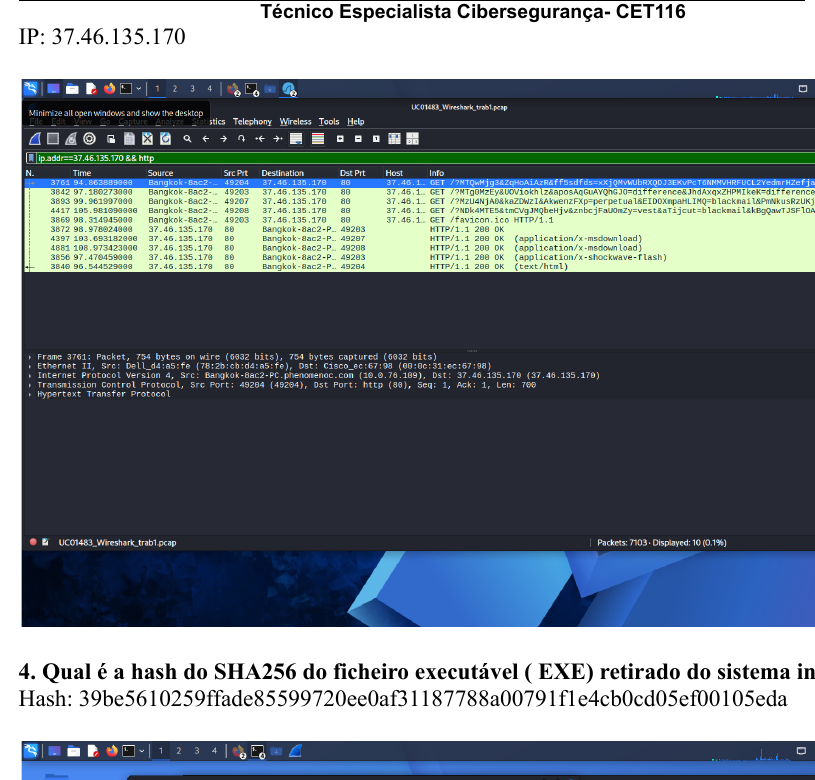
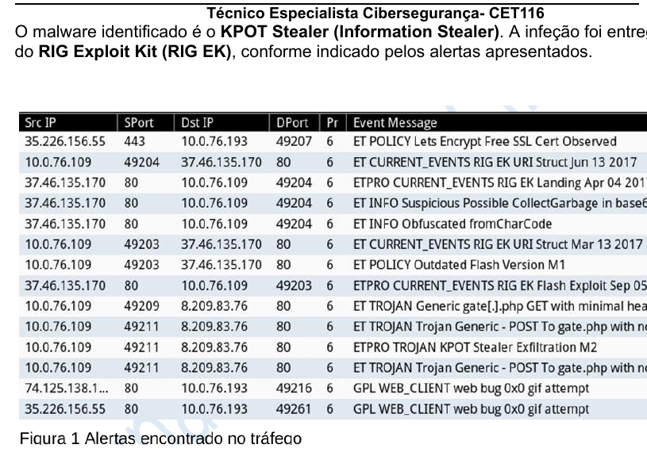
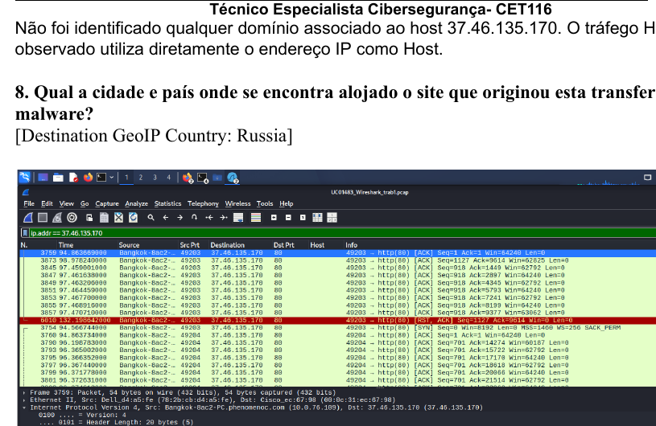

# 🔎 Wireshark Malware Traffic Analysis

## PCAP Investigation | Network Forensics | Blue Team Lab

This project documents a hands-on network traffic investigation performed with **Wireshark** as part of my Cybersecurity Specialist training.

The objective was to investigate a PCAP capture from a compromised Windows environment and identify the infected host, affected user, suspicious external infrastructure, malware activity and Indicators of Compromise (IOCs).

> **Note:** The findings presented here reflect my analysis during the training lab and are documented as part of my cybersecurity learning journey.

---

## 🎯 Investigation Objectives

The investigation focused on answering the following questions:

- Which Windows host was compromised?
- What IP and MAC address belonged to the infected machine?
- Which user account was associated with the compromised system?
- Which external IP was involved in the suspicious activity?
- What executable was associated with the infection?
- What was its SHA-256 hash?
- Which malware family was indicated by the alerts?
- What delivery mechanism was observed?
- Where was the external infrastructure geographically located?

---

## 🛠️ Tools & Environment

- **Wireshark**
- **Kali Linux**
- PCAP network capture
- Network protocol analysis
- SHA-256 hashing
- GeoIP analysis

The investigation was performed in an isolated lab environment.

---

# 🔍 Investigation

## 1. Identifying the Compromised Host

During my analysis, I identified the following information associated with the compromised Windows host:

| Indicator | Finding |
|---|---|
| Hostname | `BANGKOK-8AC2-PC` |
| IP Address | `10.0.76.109` |
| MAC Address | `78:2b:cb:d4:a5:fe` |
| Domain | `phenomenoc.com` |
| User | `edris.knight` |

### Evidence — IP Address

The packet analysis below was used during the investigation to identify the internal IP address associated with the Windows host.



### Evidence — MAC Address

Ethernet information in the captured traffic was examined to identify the MAC address associated with the host.



### Evidence — Host and User Identification

Additional information in the captured traffic was used during the investigation to identify the Windows hostname and associated user account.



---

## 2. Investigating the External Infrastructure

During the investigation, I identified communication involving the following external IP:

`37.46.135.170`

In my analysis, this IP was associated with the suspicious activity observed in the capture.

The HTTP traffic examined in the lab used the IP address directly rather than an associated domain name.

### Evidence — External IP



---

## 3. Executable and SHA-256 Analysis

During the investigation, the executable associated with the activity was analyzed and the following SHA-256 hash was recorded:

```text
39be5610259ffade85599720ee0af31187788a00791f1e4cb0cd05ef00105eda
```

Cryptographic hashes can be useful Indicators of Compromise because they allow suspicious files to be identified and correlated during security investigations.

The screenshot above also documents the hash-analysis stage of the lab.

---

## 4. Malware Identification

Based on the alerts and network traffic analyzed during the lab, I identified activity associated with:

### KPOT Stealer

The alerts examined during the investigation also indicated:

### RIG Exploit Kit (RIG EK)

These findings were based on the evidence available in the provided PCAP and alerts during the exercise.

### Evidence — Malware Alerts



---

## 5. Geographic Analysis

GeoIP information available during the investigation indicated the following information for the external infrastructure:

| Attribute | Finding |
|---|---|
| Country | Russia |
| ASN | `29182` |
| Organization | `JSC IOT` |
| City | Not identified by the GeoIP database used |

### Evidence — GeoIP Analysis



---

# 🚨 Indicators of Compromise

The following indicators were collected during my investigation:

| Type | Indicator |
|---|---|
| Infected Host | `BANGKOK-8AC2-PC` |
| Internal IP | `10.0.76.109` |
| MAC Address | `78:2b:cb:d4:a5:fe` |
| User | `edris.knight` |
| External IP | `37.46.135.170` |
| Malware identified in lab | `KPOT Stealer` |
| Delivery mechanism indicated | `RIG Exploit Kit` |
| SHA-256 | `39be5610259ffade85599720ee0af31187788a00791f1e4cb0cd05ef00105eda` |

---

# 🧠 What I Learned

This investigation helped me understand how network traffic can be used to reconstruct a cybersecurity incident.

Rather than examining packets individually, I practiced correlating multiple pieces of evidence to investigate:

- compromised endpoints;
- IP and MAC addresses;
- hostnames and user information;
- suspicious external infrastructure;
- malware-related network activity;
- file hashes;
- and Indicators of Compromise.

Most importantly, this lab helped me understand how **packet-level evidence can be correlated to build a larger picture of a security incident**.

It also strengthened my understanding of how Wireshark can support **network forensics, incident investigation and Blue Team/SOC activities**.

---

# 📚 Training Context

This lab was completed as part of my **Cybersecurity Specialist (CET)** training at **CINEL – Lisbon**, during the unit:

**UC01483 — Detecting and Analyzing Vulnerabilities in Web Solutions**

The original exercise was completed in July 2026.

---

# 👩‍💻 About Me

I am a cybersecurity student based in Portugal, building hands-on experience in:

- SOC / Blue Team fundamentals
- Network Security
- Network Traffic Analysis
- Linux
- Windows Server
- SIEM
- Vulnerability Management

This repository is part of my cybersecurity portfolio documenting my practical learning journey.
